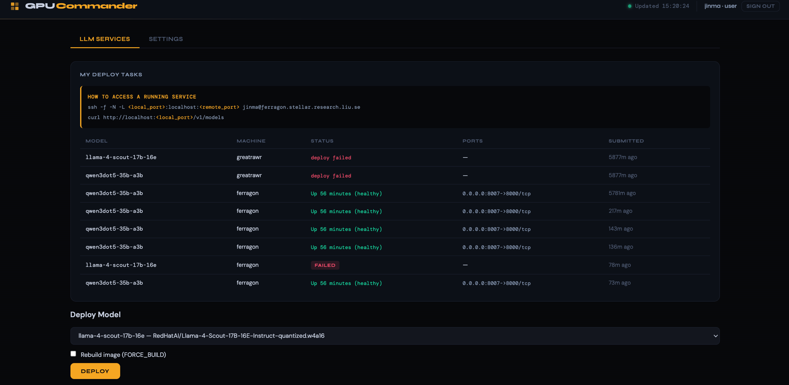
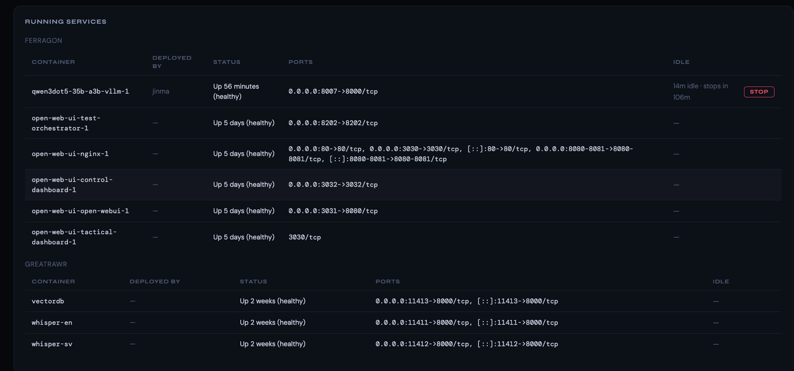

# GPU Commander

A system to run commands, monitor GPUs, and manage task queues across multiple GPU machines.

## Screenshots

**LLM Services — deploy models and track task history**



**Running Services — live container status across all machines**



## Architecture

- **Agent** — FastAPI daemon running on each GPU machine (exposes REST API)
- **Coordinator** — Central server on your Mac that aggregates all agents
- **Web UI** — Dashboard served by the coordinator at `http://localhost:9800`
- **CLI** — Command-line tool to interact with any machine

## Quick Start

### 1. Configure machines

Edit `config.yaml` with your machine SSH aliases, ports, and remote directories.

### 2. Install dependencies (on Mac)

```bash
pip install fastapi 'uvicorn[standard]' httpx pyyaml click
```

### 3. Deploy agents to GPU machines

Uses the existing `meta_script.sh` workflow:

```bash
cd /Users/maojingwei/baidu/project/ && source common_tools/meta_script.sh ferragon gpu_commander remote_
cd /Users/maojingwei/baidu/project/ && source common_tools/meta_script.sh alvis1 gpu_commander remote_
```

This rsyncs the project to the remote machine and starts the agent daemon.

### 4. Start the coordinator

```bash
./start_coordinator.sh
```

Then open http://localhost:9800 for the web dashboard.

### 5. Use the CLI

```bash
# Add alias to your shell
alias gpu-cmd='python3 /path/to/gpu_commander/cli/gpu_cmd.py'

# List machines
gpu-cmd machines

# GPU status
gpu-cmd status                          # all machines
gpu-cmd status ferragon       # one machine

# Run a command
gpu-cmd run ferragon "nvidia-smi"
gpu-cmd run alvis1 "python train.py" --timeout 3600
gpu-cmd run ferragon "python train.py" -bg  # background

# Task queue
gpu-cmd submit ferragon "python train.py --epochs 100"
gpu-cmd tasks ferragon
gpu-cmd cancel ferragon <task-id>
```

## Security

By default, agents use a shared token for authentication. Set the token in `config.yaml` under `auth.token`, and ensure the same token is used by agents (set via `GPU_COMMANDER_TOKEN` env var, handled automatically by `remote.sh`).

For production use, consider running agents behind an SSH tunnel instead of exposing ports directly.
